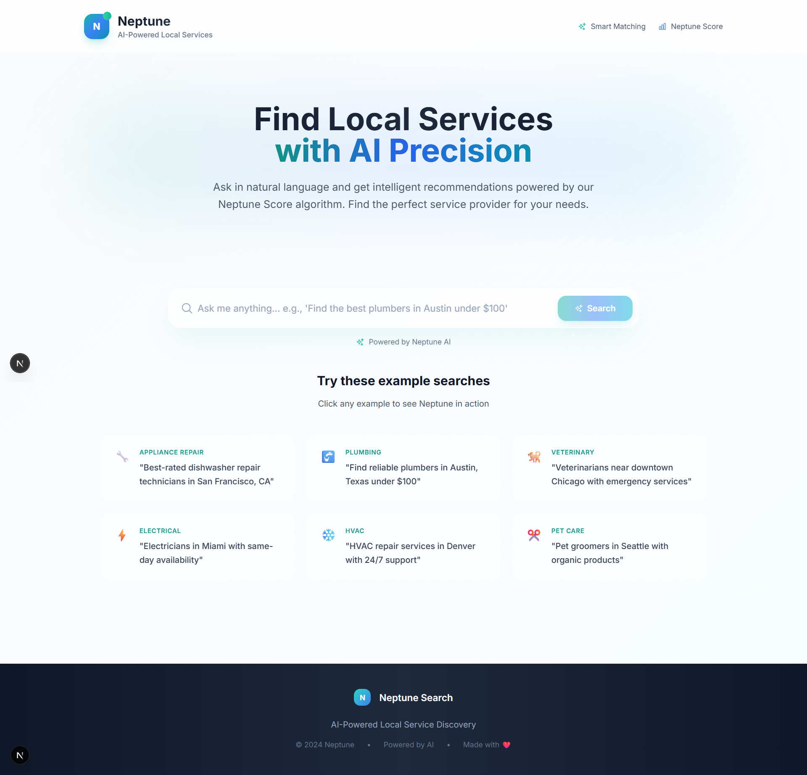

# Neptune Search App 🌊

A modern, AI-powered service provider search platform built with Next.js and TypeScript.



## ✨ Features

- 🤖 AI-powered search analysis and insights
- 🎯 Intelligent provider matching
- 📊 Neptune Score-based ranking system
- 🎨 Modern, responsive UI with Tailwind CSS
- ⚡ Real-time search results

## 🚀 Tech Stack

- **Framework:** Next.js 15
- **Language:** TypeScript
- **Styling:** Tailwind CSS
- **UI Components:** Radix UI
- **AI Integration:** Google AI
- **Form Handling:** React Hook Form
- **Data Validation:** Zod
- **Icons:** Heroicons & Lucide React
- **Charts:** Recharts
- **Date Handling:** date-fns

## 🛠️ Getting Started

### Prerequisites

- Node.js (Latest LTS version recommended)
- npm, yarn, or pnpm

### Installation

1. Clone the repository:
   ```bash
   git clone https://github.com/yourusername/neptune-search-app.git
   cd neptune-search-app
   ```

2. Install dependencies:
   ```bash
   npm install
   # or
   yarn install
   # or
   pnpm install
   ```

3. Set up environment variables:
   Create a `.env.local` file in the root directory and add your API keys:
   ```
   GOOGLE_AI_API_KEY=your_google_ai_api_key
   ```

4. Run the development server:
   ```bash
   npm run dev
   # or
   yarn dev
   # or
   pnpm dev
   ```

5. Open [http://localhost:3000](http://localhost:3000) in your browser.

## 📦 Available Scripts

- `npm run dev` - Start development server
- `npm run build` - Build for production
- `npm run start` - Start production server
- `npm run lint` - Run ESLint

## 🏗️ Project Structure

```
neptune-search-app/
├── app/              # Next.js app directory
├── components/       # React components
├── lib/             # Utility functions and configurations
├── public/          # Static assets
├── styles/          # Global styles
├── types/           # TypeScript type definitions
└── hooks/           # Custom React hooks
```


## 🙏 Acknowledgments

- [Next.js](https://nextjs.org/)
- [Tailwind CSS](https://tailwindcss.com/)
- [Radix UI](https://www.radix-ui.com/)
- [Google AI](https://ai.google.dev/)

---

Built with ❤️ using modern web technologies 